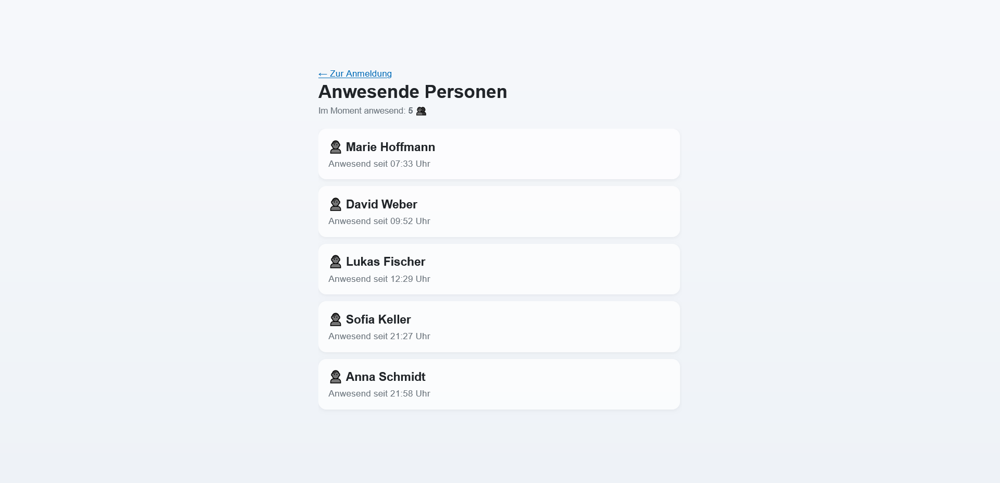
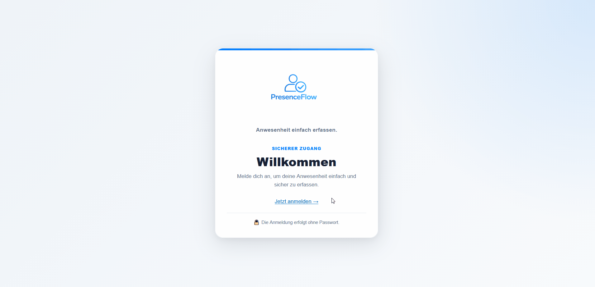

<p align="center">
    
</p>

# PresenceFlow

PresenceFlow ist eine webbasierte Anwesenheitsverwaltung, die mit ASP.NET Core und Blazor Server entwickelt wurde.

Das Projekt entstand ursprünglich während eines Praktikums und wurde anschließend als eigenständiges Portfolio-Projekt weiterentwickelt. Dabei wurden unter anderem ein lokaler Standalone-Betrieb, ein UI-basierter Demo-Modus sowie verschiedene strukturelle und sicherheitsrelevante Verbesserungen umgesetzt.



## Hintergrund

## Hintergrund

PresenceFlow entstand ursprünglich als Praktikumsprojekt, das ich eigenständig zur Anwesenheitserfassung entwickelt habe.

Mitarbeitende konnten sich über einen QR-Code im Eingangsbereich bewusst an- oder abmelden. Die Anwendung verwaltete den Anwesenheitsstatus und stellte diesen über ioBroker als zentrale Datenquelle bereit. Andere Systeme, beispielsweise für Alarmanlage, Beleuchtung oder Heizung, konnten diese Informationen anschließend weiterverwenden.

Für dieses öffentliche Portfolio-Projekt wurde die Anwendung anschließend umfassend überarbeitet und zu einer eigenständigen Portfolio-Version weiterentwickelt. Ziel war es, sie unabhängig von der ursprünglichen Infrastruktur lauffähig, leicht nachvollziehbar und für Demonstrationszwecke geeignet zu machen.

Dazu wurden unter anderem ein lokaler SQLite-Modus, ein UI-basierter Demo-Modus, eine klarere Projektstruktur sowie zusätzliche Sicherheits- und Komfortfunktionen ergänzt.

Die Anwendung unterstützt einen lokalen Standalone-Betrieb mit SQLite sowie die Anbindung an ioBroker. Für eine einfache lokale Demonstration steht ein UI-basierter Magic-Link-Modus zur Verfügung, der keinen externen E-Mail-Dienst benötigt.


## Funktionen

* Anmeldung über einmalig verwendbare Magic Links
* UI-basierter Demo-Modus ohne externen Mailversand
* optionaler E-Mail-Versand über Azure Communication Services
* Cookie-basierte Authentifizierung
* Anwesenheitsstatus setzen und anzeigen
* Live-Aktualisierungen über SignalR
* lokaler Standalone-Betrieb mit SQLite
* optionale Speicherung über ioBroker
* rollenbasierte Benutzerdaten als Grundlage für spätere Erweiterungen
* globales Abmelden bestehender Sitzungen über eine Authentifizierungsversion

## Was dieses Projekt zeigt

PresenceFlow dient als Portfolio-Projekt und demonstriert unter anderem:

* eine mehrschichtige Architektur mit klarer Trennung von UI, Geschäftslogik und Datenzugriff
* austauschbare Speicherimplementierungen über das Repository Pattern (`SQLite` und `ioBroker`)
* Magic-Link-Authentifizierung mit unterschiedlichen Providern für Demo- und Produktivbetrieb
* Live-Aktualisierung der Anwesenheitsdaten über SignalR
* Konfigurations- und Sicherheitskonzepte für eine lokal ausführbare ASP.NET-Core-Anwendung
* die Aufbereitung eines ursprünglich praxisbezogenen Projekts zu einer eigenständig testbaren Portfolio-Anwendung

## Technologien

* ASP.NET Core
* Blazor Server
* Entity Framework Core
* SQLite
* SignalR
* Cookie Authentication
* Azure Communication Services
* Dependency Injection
* Repository Pattern

## Architektur

Der Zugriff auf die Anwesenheitsdaten erfolgt über das Interface `IPresenceRepository`.

Aktuell stehen zwei Implementierungen zur Verfügung:

* `SQLiteRepository` für den lokalen Standalone-Betrieb
* `IoBrokerRepository` für die Anbindung an einen ioBroker-Datenpunkt

Die fachliche Logik wird durch `PresenceService` gebündelt. Änderungen am Anwesenheitsstatus werden über SignalR an verbundene Clients übertragen.

Die Magic-Link-Authentifizierung ist über einen eigenen Service gekapselt. Je nach Konfiguration wird der erzeugte Link entweder direkt in der Benutzeroberfläche angezeigt oder über Azure Communication Services per E-Mail versendet.

## Lokaler Start

### Voraussetzungen

* installiertes .NET SDK
* ein aktueller Webbrowser

### Anwendung starten

Repository klonen und in das Projektverzeichnis wechseln:

```bash
git clone <REPOSITORY-URL>
cd PresenceFlow
```

Anwendung starten:

```bash
dotnet run
```

Anschließend eine der in der Konsole angezeigten lokalen Adressen öffnen.

Im SQLite-Modus werden vorhandene Entity-Framework-Core-Migrationen beim Start automatisch angewendet. Bei einer leeren Datenbank werden fiktive Demo-Benutzer angelegt.

## Portfolio-Demo



Standardmäßig verwendet die Anwendung den UI-basierten Magic-Link-Demomodus:

```json
"MagicLink": {
  "Provider": "UI"
}
```

Auf der Loginseite stehen zwei Beispielkonten zur Verfügung:

| Rolle         | E-Mail-Adresse             |
| ------------- | -------------------------- |
| Benutzer      | `sofia.keller@example.com` |
| Administrator | `anna.schmidt@example.com` |

Nach Auswahl einer Adresse wird ein einmaliger Anmeldelink direkt in der Benutzeroberfläche angezeigt.

Es wird dabei keine E-Mail versendet und kein externer Dienst benötigt.

Der UI-Modus dient ausschließlich der lokalen Portfolio-Demonstration und ist nicht für einen produktiven Betrieb vorgesehen.

## SQLite-Konfiguration

Der SQLite-Modus ist für die lokale Demonstration vorgesehen.

```json
"ConnectionStrings": {
  "DefaultConnection": "Data Source=presence.db"
},
"Storage": {
  "Provider": "SQLite"
}
```

Die lokale Datenbankdatei wird nicht in Git versioniert.

## ioBroker-Konfiguration

Für die Verwendung von ioBroker muss der Storage-Provider angepasst werden:

```json
"Storage": {
  "Provider": "IoBroker"
},
"IoBroker": {
  "PersonenObjectUrl": "https://example.com/iobroker-object"
}
```

Die konkrete URL hängt von der jeweiligen ioBroker-Installation ab und sollte nicht in ein öffentliches Repository eingecheckt werden.

Ist ioBroker nicht erreichbar oder liefert der konfigurierte Datenpunkt keine gültige Antwort, wird dies von der Anwendung als Speicherfehler behandelt und nicht als leere Personenliste dargestellt.

## E-Mail-Modus

Für den Versand echter Magic Links kann Azure Communication Services verwendet werden.

```json
"App": {
  "BaseUrl": "https://example.com"
},
"MagicLink": {
  "Provider": "Email"
},
"AzureEmail": {
  "ConnectionString": "",
  "SenderAddress": ""
}
```

Für den E-Mail-Modus werden folgende Werte benötigt:

* eine absolute HTTPS-Basis-URL
* ein gültiger Azure Communication Services Connection String
* eine verifizierte Absenderadresse

Die Anwendung validiert diese Einstellungen beim Start.

Zugangsdaten sollten nicht direkt in `appsettings.json` gespeichert werden. Geeignete Alternativen sind:

* .NET User Secrets für die lokale Entwicklung
* Umgebungsvariablen
* die Secret-Verwaltung der verwendeten Hosting-Plattform

Beispiel mit Umgebungsvariablen:

```text
App__BaseUrl
MagicLink__Provider
AzureEmail__ConnectionString
AzureEmail__SenderAddress
```

## Magic-Link-Ablauf

1. Der Benutzer gibt eine hinterlegte E-Mail-Adresse ein.
2. Die Anwendung erzeugt einen zufälligen, zeitlich begrenzten Token.
3. Im UI-Modus wird der Login-Link direkt angezeigt.
4. Im E-Mail-Modus wird der Link über Azure Communication Services versendet.
5. Beim Öffnen wird der Token geprüft und einmalig konsumiert.
6. Nach erfolgreicher Prüfung wird ein Authentifizierungs-Cookie erstellt.

Im E-Mail-Modus wird nicht offengelegt, ob eine eingegebene Adresse im System vorhanden ist.

## Sicherheit und Datenschutz

* Die enthaltenen Namen und E-Mail-Adressen sind vollständig fiktiv.
* Es werden keine produktiven Zugangsdaten im Repository bereitgestellt.
* Magic Links sind nur zeitlich begrenzt gültig.
* Magic Links können nur einmal verwendet werden.
* Authentifizierungs-Cookies sind gegen clientseitigen Zugriff abgesichert und werden ausschließlich über HTTPS übertragen.
* `SameSite=Lax` reduziert das Risiko bestimmter CSRF-Angriffe.
* Sitzungen verwenden eine gleitende Ablaufzeit (Sliding Expiration).
* Die Anzeige der Personenliste erfordert eine Anmeldung.
* Reale Personen- oder Unternehmensdaten sollten nicht in das öffentliche Repository aufgenommen werden.

## Bekannte Einschränkungen

PresenceFlow ist ein Portfolio-Projekt und derzeit nicht als vollständig produktionsreife Anwendung vorgesehen.

Aktuelle Einschränkungen:

* Magic-Link-Tokens werden nur im Arbeitsspeicher gespeichert.
* Ein Neustart der Anwendung macht noch nicht verwendete Links ungültig.
* Es existiert noch kein Rate Limiting für Login-Anfragen.
* Automatisierte Tests sind noch nicht Bestandteil des Projekts.
* Der Adminbereich ist noch nicht umgesetzt.
* Der ioBroker-Modus benötigt eine vorhandene externe Installation und Konfiguration.
* Für mehrere Anwendungsinstanzen wäre eine gemeinsame Token- und Data-Protection-Speicherung erforderlich.

## Roadmap

Geplante oder mögliche spätere Erweiterungen:

* Unit Tests
* Integrationstests
* GitHub Actions (CI)
* Docker
* Azure-Deployment
* persistente Magic-Link-Tokens
* Rate Limiting
* typisierte Options-Klassen
* erweiterte Rollen- und Rechteverwaltung
* Adminbereich
* Benutzerverwaltung
* Anwesenheitshistorie
* persistente Data-Protection-Keys
* Health Checks und Monitoring

## Projektstatus

Dieses Repository dokumentiert die Weiterentwicklung eines ursprünglich im Praktikum entstandenen Projekts zu einer eigenständig nutzbaren Portfolio-Anwendung.

Der Fokus des ersten Releases liegt auf einer nachvollziehbaren Architektur, einer lokal ausführbaren Demonstration und einer klaren Trennung zwischen Portfolio-Demo und optionaler externer Infrastruktur.

## Lizenz

Dieses Projekt steht unter der [MIT-Lizenz](LICENSE).